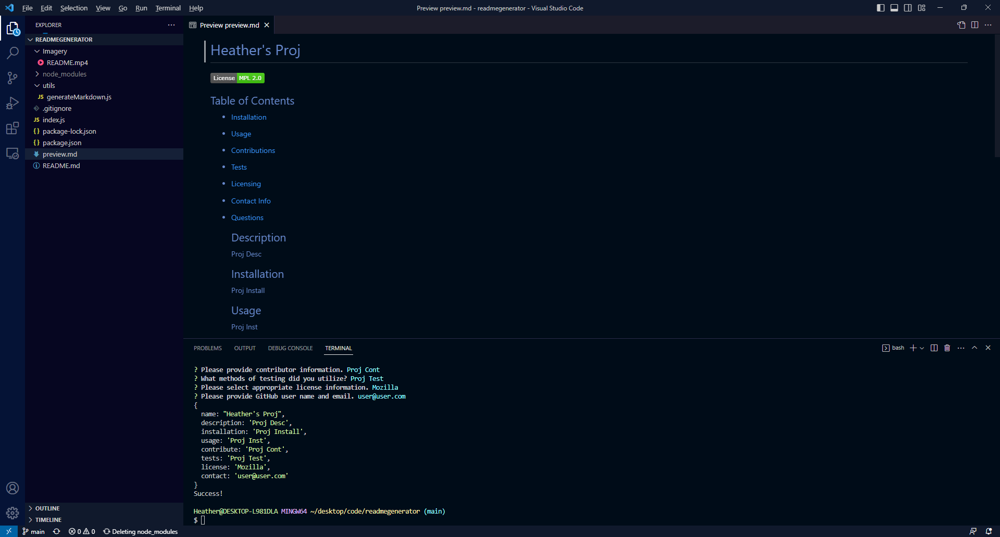
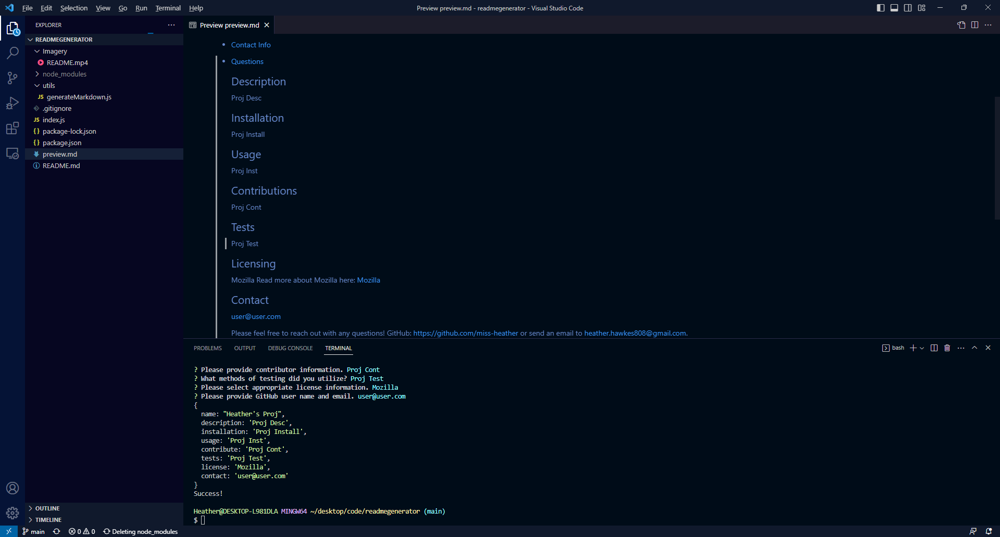

## README.md Generator

## README.md Generator Description:
The purpose of this application is to quickly create professional README.md pages. It includes places to include the application's description, installation instructions, usage information, contribution guidelines, and test instructions. Additionally, when a license is chosen, the badge for said license will populate at the top of the page, as well as the corresponding info. There is a place to enter GitHub user information, as well as contact information to reach out to the app developer. 

[README.md Generator Video](Imagery/README.mp4)

[File to Generated Preview](preview.md)

## README.md Generator Installation
N/A

## README.md Generator Usage
To utilize this application from the integrated terminal, enter "node.js". From there, each question prompt will appear, guiding the user to fill out each portion of the information as outlined in the above description. The user will then see the corresponding file appear,  housing their newly generated, completed README.md page.

## README.md Generator Credits
N/A

## README.md Generator License
MIT License

Copyright (c) 2023 miss-heather

Permission is hereby granted, free of charge, to any person obtaining a copy of this software and associated documentation files (the "Software"), to deal in the Software without restriction, including without limitation the rights to use, copy, modify, merge, publish, distribute, sublicense, and/or sell copies of the Software, and to permit persons to whom the Software is furnished to do so, subject to the following conditions:

The above copyright notice and this permission notice shall be included in all copies or substantial portions of the Software.

THE SOFTWARE IS PROVIDED "AS IS", WITHOUT WARRANTY OF ANY KIND, EXPRESS OR IMPLIED, INCLUDING BUT NOT LIMITED TO THE WARRANTIES OF MERCHANTABILITY, FITNESS FOR A PARTICULAR PURPOSE AND NONINFRINGEMENT. IN NO EVENT SHALL THE AUTHORS OR COPYRIGHT HOLDERS BE LIABLE FOR ANY CLAIM, DAMAGES OR OTHER LIABILITY, WHETHER IN AN ACTION OF CONTRACT, TORT OR OTHERWISE, ARISING FROM, OUT OF OR IN CONNECTION WITH THE SOFTWARE OR THE USE OR OTHER DEALINGS IN THE SOFTWARE.
